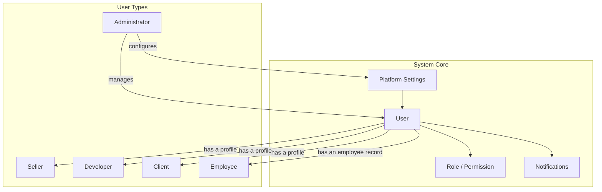

# System Core Architecture

## Overview
The system core manages the fundamental building blocks of the platform: users, authentication, authorization, settings, and notifications.

## Architecture Diagram



## Components

### User Management
| Component | Description | Key Fields |
|-----------|-------------|------------|
| User | Base user entity | id, email, name, isActive, createdAt |
| Session | User login session | token, expiresAt, deviceInfo, ipAddress |
| Verification | Identity verification | status, level, documents |

### Role & Permission System
| Component | Description |
|-----------|-------------|
| Role | User classification (admin, seller, developer, etc.) |
| Permission | Granular access control |
| Role-Permission | Many-to-many relationship |

### Platform Settings
| Category | Settings |
|----------|----------|
| Site | name, slogan, url, email, logo |
| Common | pageSize, maintenanceMode, defaultTheme |
| Points | earnRate, redeemValue, registrationBonus |
| Marketplace | platformCommission |
| Languages | availableLanguages, defaultLanguage |
| Currencies | availableCurrencies, defaultCurrency |

## Database Schema

```sql
-- Users table
CREATE TABLE users (
    id UUID PRIMARY KEY DEFAULT gen_random_uuid(),
    email VARCHAR(255) UNIQUE NOT NULL,
    password_hash VARCHAR(255) NOT NULL,
    name VARCHAR(255),
    is_active BOOLEAN DEFAULT true,
    email_verified BOOLEAN DEFAULT false,
    role VARCHAR(50) DEFAULT 'user',
    created_at TIMESTAMP DEFAULT NOW(),
    updated_at TIMESTAMP DEFAULT NOW()
);

-- Roles table
CREATE TABLE roles (
    id UUID PRIMARY KEY DEFAULT gen_random_uuid(),
    name VARCHAR(50) UNIQUE NOT NULL,
    description TEXT
);

-- Permissions table
CREATE TABLE permissions (
    id UUID PRIMARY KEY DEFAULT gen_random_uuid(),
    name VARCHAR(100) UNIQUE NOT NULL,
    description TEXT,
    category VARCHAR(50)
);

-- User roles junction
CREATE TABLE user_roles (
    user_id UUID REFERENCES users(id) ON DELETE CASCADE,
    role_id UUID REFERENCES roles(id) ON DELETE CASCADE,
    PRIMARY KEY (user_id, role_id)
);
```

## GraphQL Operations

### Queries
```graphql
# Get current user
me: User!

# Get user by ID (admin only)
user(id: ID!): User

# List users with pagination
users(page: Int, limit: Int, filter: UserFilter): UserConnection

# Get platform settings
settings: Settings!
```

### Mutations
```graphql
# Register new user
register(input: RegisterInput!): AuthPayload!

# Login
login(email: String!, password: String!): AuthPayload!

# Update user profile
updateProfile(input: UpdateProfileInput!): User!

# Update user roles (admin only)
updateUserRoles(userId: ID!, roles: [String!]!): User!

# Update platform settings (admin only)
updateSettings(input: SettingsInput!): Settings!
```

## Security Considerations
- Passwords hashed with bcrypt (cost factor 12)
- JWT tokens expire after 24 hours
- Refresh tokens stored securely
- Rate limiting on authentication endpoints
- Failed login attempt tracking

## Related Documentation
- [User Types](../00-overview/03-user-types.md)
- [Security & Compliance](../12-security/13-security-compliance.md)
- [API Reference](../13-api/14-api-reference.md)
