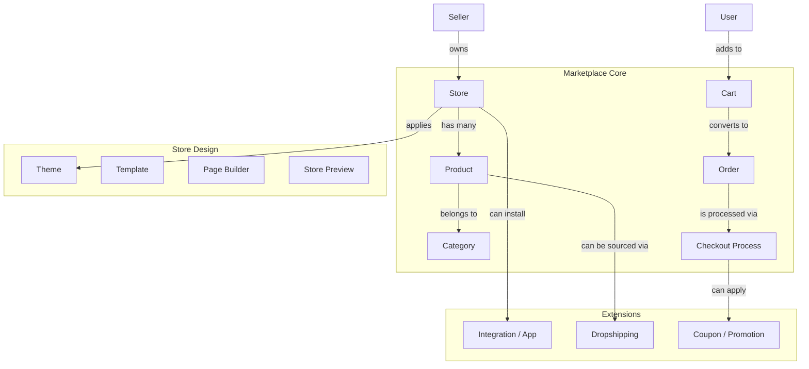
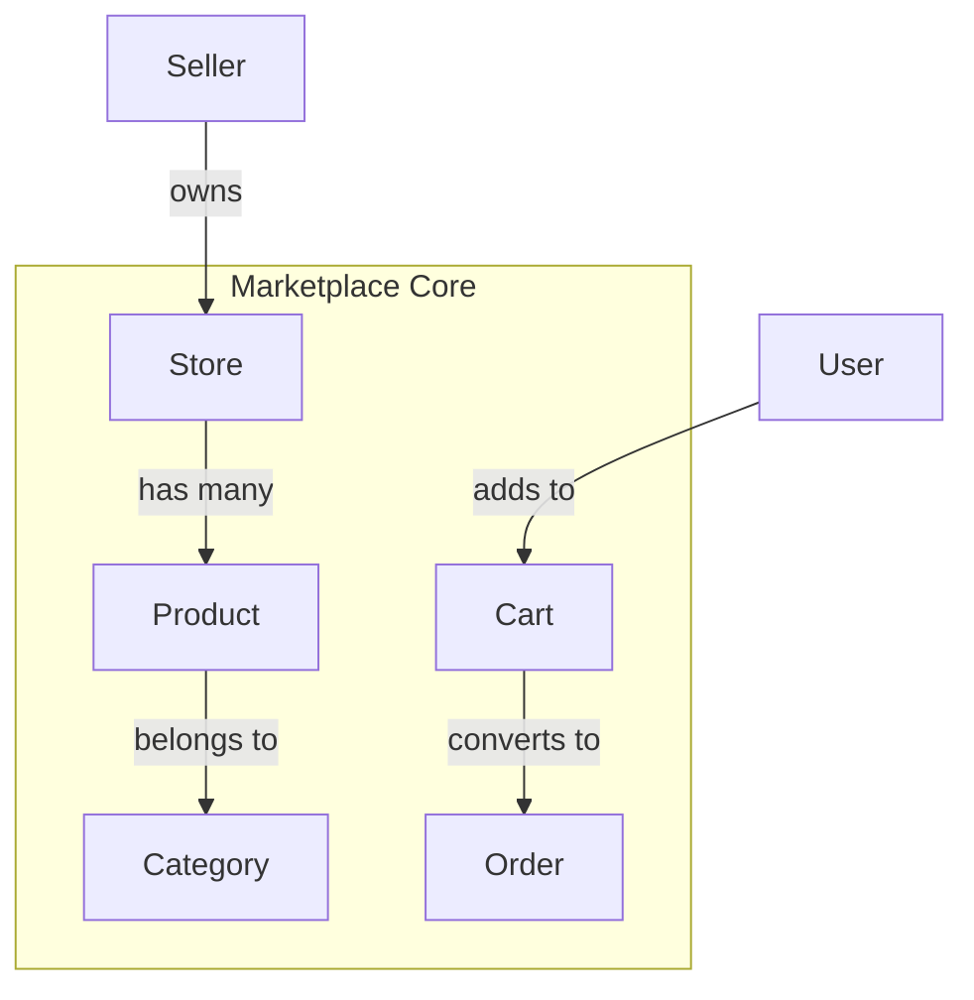

# E-commerce & Marketplace

## Overview
The marketplace module handles all e-commerce functionality including store management, product catalog, orders, and shopping cart operations.

## Architecture Diagram



## Components

### Store
| Field | Description |
|-------|-------------|
| name | Store name |
| slug | URL-friendly identifier |
| description | Store description |
| logo | Store logo image |
| banner | Store banner image |
| is_published | Whether store is published |
| is_active | Whether store is active |
| is_live | Whether store is live |

### Product
| Field | Description |
|-------|-------------|
| name | Product name |
| slug | URL-friendly identifier |
| description | Product description |
| price | Selling price |
| list_price | Original price |
| count_in_stock | Available quantity |
| category | Product category |
| images | Product images |
| variants | Product variations (color, size) |

### Order
| Field | Description |
|-------|-------------|
| order_number | Unique order identifier |
| status | Order status (pending, processing, shipped, delivered) |
| total_amount | Order total |
| items | Ordered products |
| shipping_address | Delivery address |
| tracking_number | Shipment tracking |

## Database Schema

```sql
-- Stores
CREATE TABLE stores (
    id UUID PRIMARY KEY DEFAULT gen_random_uuid(),
    seller_id UUID REFERENCES sellers(id) ON DELETE CASCADE,
    name VARCHAR(255) NOT NULL,
    slug VARCHAR(255) UNIQUE NOT NULL,
    description TEXT,
    logo VARCHAR(500),
    banner VARCHAR(500),
    is_published BOOLEAN DEFAULT false,
    is_active BOOLEAN DEFAULT true,
    is_live BOOLEAN DEFAULT false,
    settings JSONB,
    created_at TIMESTAMP DEFAULT NOW(),
    updated_at TIMESTAMP DEFAULT NOW()
);

-- Products
CREATE TABLE products (
    id UUID PRIMARY KEY DEFAULT gen_random_uuid(),
    store_id UUID REFERENCES stores(id) ON DELETE CASCADE,
    name VARCHAR(255) NOT NULL,
    slug VARCHAR(255) NOT NULL,
    description TEXT,
    price DECIMAL(10,2) NOT NULL,
    list_price DECIMAL(10,2),
    count_in_stock INT DEFAULT 0,
    category_id UUID REFERENCES categories(id),
    images JSONB,
    attributes JSONB,
    status VARCHAR(20) DEFAULT 'draft',
    created_at TIMESTAMP DEFAULT NOW(),
    updated_at TIMESTAMP DEFAULT NOW(),
    UNIQUE(store_id, slug)
);

-- Orders
CREATE TABLE orders (
    id UUID PRIMARY KEY DEFAULT gen_random_uuid(),
    order_number VARCHAR(50) UNIQUE NOT NULL,
    user_id UUID REFERENCES users(id),
    store_id UUID REFERENCES stores(id),
    total_amount DECIMAL(10,2) NOT NULL,
    status VARCHAR(20) DEFAULT 'pending',
    payment_status VARCHAR(20) DEFAULT 'pending',
    fulfillment_status VARCHAR(20) DEFAULT 'unfulfilled',
    shipping_address JSONB,
    tracking_number VARCHAR(100),
    created_at TIMESTAMP DEFAULT NOW(),
    updated_at TIMESTAMP DEFAULT NOW()
);

-- Order Items
CREATE TABLE order_items (
    id UUID PRIMARY KEY DEFAULT gen_random_uuid(),
    order_id UUID REFERENCES orders(id) ON DELETE CASCADE,
    product_id UUID REFERENCES products(id),
    product_name VARCHAR(255) NOT NULL,
    quantity INT NOT NULL,
    price DECIMAL(10,2) NOT NULL,
    variant_data JSONB,
    created_at TIMESTAMP DEFAULT NOW()
);

-- Carts
CREATE TABLE carts (
    id UUID PRIMARY KEY DEFAULT gen_random_uuid(),
    user_id UUID REFERENCES users(id),
    session_id VARCHAR(255),
    store_id UUID REFERENCES stores(id),
    items JSONB,
    subtotal DECIMAL(10,2) DEFAULT 0,
    total DECIMAL(10,2) DEFAULT 0,
    expires_at TIMESTAMP,
    created_at TIMESTAMP DEFAULT NOW(),
    updated_at TIMESTAMP DEFAULT NOW()
);
```

## GraphQL Operations

### Queries
```graphql
type Query {
    # Store queries
    stores(page: Int, limit: Int): StoreConnection!
    storeBySlug(slug: String!): Store!
    myStores: [Store!]!
    
    # Product queries
    products(storeId: ID!, filter: ProductFilter): ProductConnection!
    productBySlug(storeId: ID!, slug: String!): Product!
    featuredProducts(storeId: ID!, limit: Int): [Product!]!
    
    # Category queries
    categories(storeId: ID!): [Category!]!
    categoryBySlug(storeId: ID!, slug: String!): Category!
    
    # Order queries
    orders(storeId: ID!, filter: OrderFilter): OrderConnection!
    orderById(orderId: ID!): Order!
    customerOrders(userId: ID!): [Order!]!
    
    # Cart queries
    cart(storeId: ID!, sessionId: String!): Cart!
}
```

### Mutations
```graphql
type Mutation {
    # Store mutations
    createStore(input: CreateStoreInput!): StoreResponse!
    updateStore(storeId: ID!, input: UpdateStoreInput!): StoreResponse!
    publishStore(storeId: ID!): StoreResponse!
    deleteStore(storeId: ID!): DeleteResponse!
    
    # Product mutations
    createProduct(storeId: ID!, input: ProductInput!): ProductResponse!
    updateProduct(productId: ID!, input: ProductUpdateInput!): ProductResponse!
    deleteProduct(productId: ID!): DeleteResponse!
    updateProductStock(productId: ID!, quantity: Int!, type: String!): StockResponse!
    
    # Order mutations
    createOrder(input: CreateOrderInput!): OrderResponse!
    updateOrderStatus(orderId: ID!, status: String!): OrderResponse!
    addOrderTracking(orderId: ID!, trackingNumber: String!, carrier: String!): OrderResponse!
    cancelOrder(orderId: ID!): OrderResponse!
    
    # Cart mutations
    addToCart(storeId: ID!, input: CartItemInput!): CartResponse!
    updateCartItem(cartId: ID!, itemId: ID!, quantity: Int!): CartResponse!
    removeCartItem(cartId: ID!, itemId: ID!): CartResponse!
    clearCart(cartId: ID!): CartResponse!
    applyCoupon(cartId: ID!, couponCode: String!): CartResponse!
}
```

## Input Types

```graphql
input CreateStoreInput {
    name: String!
    description: String
    logo: Upload
    banner: Upload
    settings: StoreSettingsInput
}

input ProductInput {
    name: String!
    description: String
    price: Float!
    listPrice: Float
    countInStock: Int!
    categoryId: ID
    images: [Upload!]
    variants: [VariantInput!]
    tags: [String!]
    attributes: JSON
}

input CreateOrderInput {
    storeId: ID!
    items: [OrderItemInput!]!
    shippingAddress: AddressInput!
    paymentMethod: String!
    notes: String
}

input CartItemInput {
    productId: ID!
    variantId: ID
    quantity: Int!
}
```

## Response Types

```graphql
type Store {
    id: ID!
    name: String!
    slug: String!
    description: String
    logo: String
    banner: String
    isPublished: Boolean!
    isActive: Boolean!
    isLive: Boolean!
    seller: Seller!
    settings: StoreSettings
    analytics: StoreAnalytics
    createdAt: String!
    updatedAt: String!
    url: String!
    previewUrl: String!
}

type Product {
    id: ID!
    name: String!
    slug: String!
    description: String
    price: Float!
    listPrice: Float
    finalPrice: Float!
    countInStock: Int!
    category: Category
    images: [String!]!
    variants: [Variant!]!
    rating: Float
    numReviews: Int
    tags: [String!]
    attributes: JSON
    createdAt: String!
    updatedAt: String!
    isPublished: Boolean!
}

type Order {
    id: ID!
    orderNumber: String!
    status: OrderStatus!
    paymentStatus: PaymentStatus!
    fulfillmentStatus: FulfillmentStatus!
    totalAmount: Float!
    items: [OrderItem!]!
    shippingAddress: Address!
    trackingNumber: String
    trackingUrl: String
    estimatedDelivery: String
    notes: String
    createdAt: String!
    updatedAt: String!
}
```

## Error Codes

| Code | Description |
|------|-------------|
| STORE_001 | Store not found |
| STORE_002 | Store already exists |
| STORE_003 | Store not published |
| PRODUCT_001 | Product not found |
| PRODUCT_002 | Insufficient stock |
| PRODUCT_003 | Product not published |
| ORDER_001 | Order not found |
| ORDER_002 | Order cannot be cancelled |
| ORDER_003 | Invalid order status |
| CART_001 | Cart not found |
| CART_002 | Item not in cart |
| CART_003 | Cart expired |
| COUPON_001 | Invalid coupon |
| COUPON_002 | Coupon expired |
| COUPON_003 | Coupon usage limit exceeded |

## Related Documentation
- [Inventory Management](../08-inventory/09-inventory-management.md)
- [Order Fulfillment](../10-fulfillment/11-order-fulfillment.md)
- [Store Design](../09-design/10-store-design.md)


