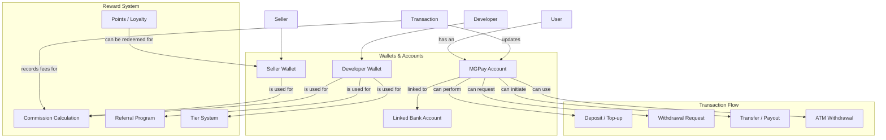

# Wallet & Payment System (MGPay)

## Overview
MGPay is the unified payment system that manages all financial transactions across the platform, including seller wallets, developer wallets, commissions, referrals, and tier-based rewards.

## Architecture Diagram



## Wallet Types

### Seller Wallet
| Field | Description |
|-------|-------------|
| balance | Current available balance |
| pending_withdrawals | Amount pending approval |
| total_earned | Lifetime earnings |
| total_withdrawn | Total withdrawn amount |
| currency | Wallet currency (default: USD) |

### Developer Wallet
| Field | Description |
|-------|-------------|
| balance | Current available balance |
| pending_withdrawals | Amount pending approval |
| total_earned | Lifetime earnings |
| total_withdrawn | Total withdrawn amount |
| referral_code | Unique referral code |
| referral_stats | Referral statistics |
| current_tier | Current tier level |
| tier_history | Tier upgrade history |

## Transaction Types

| Type | Description | Fees |
|------|-------------|------|
| deposit | Adding funds to account | Platform fee |
| withdrawal | Requesting payout | Processing fee |
| transfer | Internal transfer | Transfer fee |
| commission | Earnings from sales | None (earned) |
| referral_bonus | Referral reward | None (earned) |
| refund | Reversal of payment | Refund fee |
| atm_withdrawal | ATM cash withdrawal | ATM fee |

## Commission Structure

### Seller Commission
| Category | Base Rate | Tier Discount | Effective Rate |
|----------|-----------|---------------|----------------|
| Physical Products | 10% | Up to 5% | 5-10% |
| Digital Products | 15% | Up to 5% | 10-15% |
| Services | 12% | Up to 5% | 7-12% |

### Developer Commission
| Tier | Standard Rate | Discount | Final Rate |
|------|---------------|----------|------------|
| Bronze | 30% | 0% | 30% |
| Silver | 30% | 5% | 25% |
| Gold | 30% | 10% | 20% |
| Platinum | 30% | 15% | 15% |

## Referral Program

### Rewards Structure
| Action | Reward |
|--------|--------|
| New developer signs up | $50 |
| First app published | $100 |
| Referral app reaches 100 installs | $200 |
| Lifetime commission | 10% of referred developer's earnings for 12 months |

## Tier System

| Tier | Requirement | Discount | Benefits |
|------|-------------|----------|----------|
| Bronze | $0 | 0% | Basic support |
| Silver | $1,000 | 5% | Priority support |
| Gold | $5,000 | 10% | Featured placement |
| Platinum | $20,000 | 15% | Dedicated manager |

## Withdrawal Process

1. User initiates withdrawal request
2. System checks balance and limits
3. Withdrawal enters pending queue
4. Admin review (if required)
5. Processing initiated
6. Funds transferred to bank account
7. Status updated to completed

## Security Measures

- 2FA required for withdrawals > $500
- Daily withdrawal limits
- Monthly withdrawal limits
- IP-based fraud detection
- Admin approval for large withdrawals (> $5,000)
- Email confirmation for new bank accounts
- 7-day hold period for new accounts

## Database Schema

```sql
-- MGPay Accounts
CREATE TABLE mgpay_accounts (
    id UUID PRIMARY KEY DEFAULT gen_random_uuid(),
    user_id UUID REFERENCES users(id) ON DELETE CASCADE,
    account_id VARCHAR(50) UNIQUE NOT NULL,
    balance DECIMAL(15,2) DEFAULT 0,
    currency VARCHAR(3) DEFAULT 'USD',
    status VARCHAR(20) DEFAULT 'pending',
    verification_level VARCHAR(20) DEFAULT 'basic',
    created_at TIMESTAMP DEFAULT NOW(),
    updated_at TIMESTAMP DEFAULT NOW()
);

-- Seller Wallets
CREATE TABLE seller_wallets (
    id UUID PRIMARY KEY DEFAULT gen_random_uuid(),
    seller_id UUID REFERENCES sellers(id) ON DELETE CASCADE,
    balance DECIMAL(15,2) DEFAULT 0,
    pending_withdrawals DECIMAL(15,2) DEFAULT 0,
    total_earned DECIMAL(15,2) DEFAULT 0,
    total_withdrawn DECIMAL(15,2) DEFAULT 0,
    currency VARCHAR(3) DEFAULT 'USD',
    updated_at TIMESTAMP DEFAULT NOW()
);

-- Transactions
CREATE TABLE mgpay_transactions (
    id UUID PRIMARY KEY DEFAULT gen_random_uuid(),
    account_id UUID REFERENCES mgpay_accounts(id),
    user_id UUID REFERENCES users(id),
    type VARCHAR(50) NOT NULL,
    amount DECIMAL(15,2) NOT NULL,
    fee DECIMAL(15,2) DEFAULT 0,
    net_amount DECIMAL(15,2) GENERATED ALWAYS AS (amount - fee) STORED,
    status VARCHAR(20) DEFAULT 'pending',
    reference_id VARCHAR(255),
    metadata JSONB,
    created_at TIMESTAMP DEFAULT NOW(),
    completed_at TIMESTAMP
);
```

## GraphQL Operations

### Queries
```graphql
type Query {
    developerWallet(developerId: String!): DeveloperWalletResponse!
    sellerWallet(sellerId: String!): SellerWalletResponse!
    mgPayAccount(userId: String!): MGPayAccountResponse!
    mgPayTransactions(userId: String!, limit: Int, offset: Int): TransactionConnection!
    mgPayWithdrawalRequests(filter: MGPayWithdrawalFilter): WithdrawalRequestConnection!
    referralStats(developerId: String!): ReferralStats!
    tierProgress(developerId: String!): TierProgress!
    calculateCommission(subscriptionPrice: Float!, appCategory: String): CommissionCalculation!
    mgPayPlatformStats: PlatformStats!
}
```

### Mutations
```graphql
type Mutation {
    depositToMGPay(input: DepositToMGPayInput!): DepositResponse!
    requestWithdrawal(input: WithdrawalRequestInput!): WithdrawalResponse!
    processWithdrawal(input: ProcessWithdrawalInput!): ProcessResponse!
    transferBetweenDevelopers(fromDeveloperId: String!, toDeveloperId: String!, amount: Float!): TransferResponse!
    generateMGPayATMCode(input: GenerateMGPayATMCodeInput!): ATMCodeResponse!
    addMGPayBankAccount(input: AddMGPayBankAccountInput!): BankAccountResponse!
    generateReferralCode(developerId: String!): ReferralCodeResponse!
    applyReferralCode(input: ApplyReferralCodeInput!): ApplyReferralResponse!
    claimReferralBonus(developerId: String!): ClaimBonusResponse!
    updateDeveloperTier(developerId: String!, tierName: String!): UpdateTierResponse!
    creditDeveloperWallet(input: CreditDeveloperWalletInput!): CreditResponse!
    adminUpdateMGPaySettings(input: UpdateMGPaySettingsInput!): UpdateSettingsResponse!
}
```

## Error Codes

| Code | Description |
|------|-------------|
| WALLET_001 | Insufficient balance |
| WALLET_002 | Daily limit exceeded |
| WALLET_003 | Monthly limit exceeded |
| WALLET_004 | Account suspended |
| WALLET_005 | Verification required |
| WALLET_006 | Invalid bank account |
| REFERRAL_001 | Invalid referral code |
| REFERRAL_002 | Already referred |
| TIER_001 | Invalid tier |
| TIER_002 | Requirements not met |

## Related Documentation
- [Wallet Integration](./08-wallet-integration.md)
- [Security & Compliance](../12-security/13-security-compliance.md)
