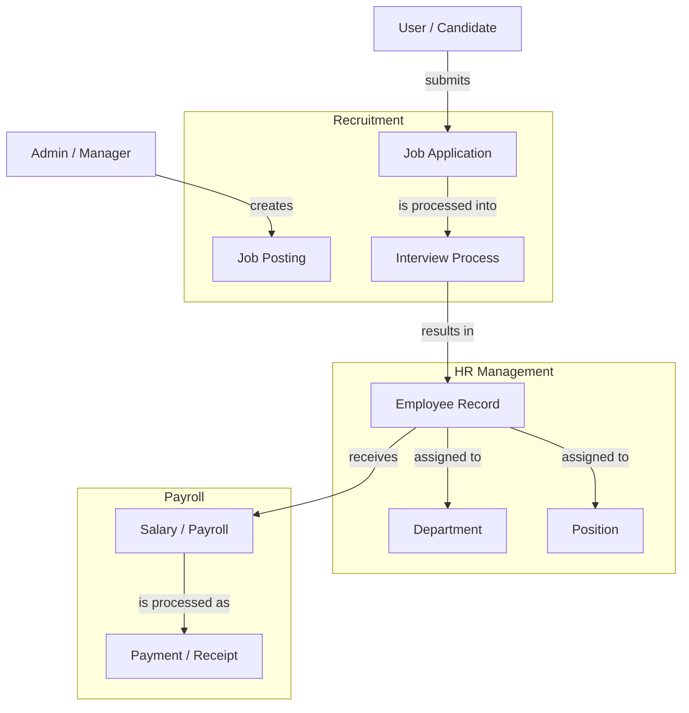
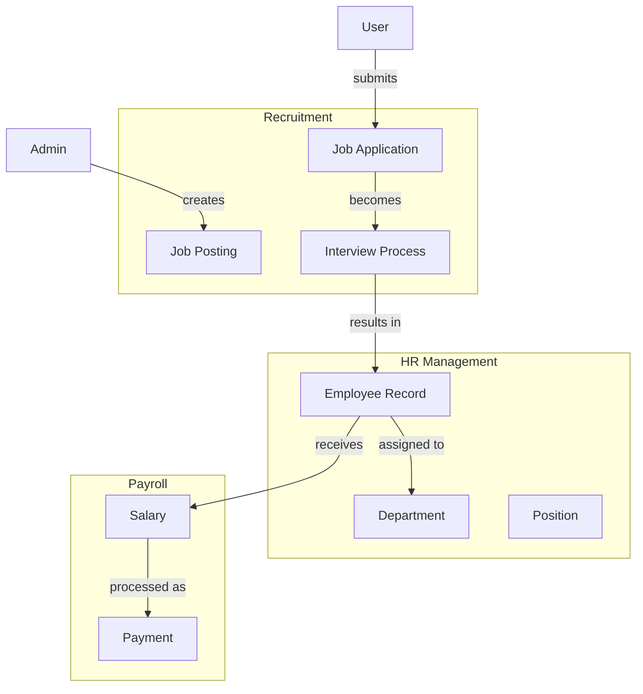

# Jobs, Recruitment & HR Management

## Overview
The HR module manages job postings, recruitment, employee records, and payroll processing.

## Architecture Diagram



## Components

### Job Posting
| Field | Description |
|-------|-------------|
| title | Job title |
| department | Department name |
| location | Job location |
| type | Full-time, part-time, contract |
| experience | Years of experience required |
| salary_range | Min and max salary |
| description | Job description |
| requirements | Required skills and qualifications |
| status | Draft, published, closed |
| deadline | Application deadline |

### Employee Record
| Field | Description |
|-------|-------------|
| employee_id | Unique employee identifier |
| user_id | Linked user account |
| department | Assigned department |
| position | Job position |
| start_date | Employment start date |
| status | Active, terminated, on_leave |
| manager_id | Reporting manager |
| salary | Compensation details |

### Payroll
| Field | Description |
|-------|-------------|
| base_salary | Base compensation |
| bonuses | Performance bonuses |
| deductions | Tax, insurance, loans |
| net_salary | Final payable amount |
| payment_date | Scheduled payment date |
| payment_status | Paid, pending, failed |

## Database Schema

```sql
-- Jobs
CREATE TABLE jobs (
    id UUID PRIMARY KEY DEFAULT gen_random_uuid(),
    title VARCHAR(255) NOT NULL,
    slug VARCHAR(255) UNIQUE NOT NULL,
    department VARCHAR(100),
    location VARCHAR(255),
    type VARCHAR(50),
    experience VARCHAR(50),
    salary_min DECIMAL(10,2),
    salary_max DECIMAL(10,2),
    description TEXT,
    requirements JSONB,
    status VARCHAR(20) DEFAULT 'draft',
    deadline TIMESTAMP,
    created_by UUID REFERENCES users(id),
    created_at TIMESTAMP DEFAULT NOW(),
    updated_at TIMESTAMP DEFAULT NOW()
);

-- Job Applications
CREATE TABLE job_applications (
    id UUID PRIMARY KEY DEFAULT gen_random_uuid(),
    job_id UUID REFERENCES jobs(id) ON DELETE CASCADE,
    user_id UUID REFERENCES users(id),
    status VARCHAR(20) DEFAULT 'pending',
    personal_info JSONB,
    resume_url VARCHAR(500),
    cover_letter TEXT,
    answers JSONB,
    reviewed_by UUID REFERENCES users(id),
    reviewed_at TIMESTAMP,
    interview_date TIMESTAMP,
    rejection_reason TEXT,
    created_at TIMESTAMP DEFAULT NOW()
);

-- Employees
CREATE TABLE employees (
    id UUID PRIMARY KEY DEFAULT gen_random_uuid(),
    user_id UUID REFERENCES users(id) UNIQUE,
    employee_id VARCHAR(50) UNIQUE NOT NULL,
    department VARCHAR(100),
    position VARCHAR(100),
    start_date DATE NOT NULL,
    end_date DATE,
    status VARCHAR(20) DEFAULT 'active',
    manager_id UUID REFERENCES employees(id),
    permissions JSONB,
    created_at TIMESTAMP DEFAULT NOW(),
    updated_at TIMESTAMP DEFAULT NOW()
);

-- Salaries
CREATE TABLE salaries (
    id UUID PRIMARY KEY DEFAULT gen_random_uuid(),
    employee_id UUID REFERENCES employees(id) ON DELETE CASCADE,
    base_amount DECIMAL(10,2) NOT NULL,
    currency VARCHAR(3) DEFAULT 'USD',
    frequency VARCHAR(20) DEFAULT 'monthly',
    bonuses JSONB,
    deductions JSONB,
    net_amount DECIMAL(10,2) GENERATED ALWAYS AS (base_amount - COALESCE((deductions->>'total')::DECIMAL, 0)) STORED,
    payment_date DATE,
    payment_status VARCHAR(20) DEFAULT 'pending',
    payment_reference VARCHAR(100),
    period_start DATE,
    period_end DATE,
    created_at TIMESTAMP DEFAULT NOW(),
    processed_at TIMESTAMP
);
```

## GraphQL Operations

### Queries
```graphql
type Query {
    # Job queries
    jobs(filter: JobFilter, page: Int, limit: Int): JobConnection!
    jobBySlug(slug: String!): Job!
    jobById(id: ID!): Job!
    
    # Application queries
    jobApplications(jobId: ID, status: ApplicationStatus): ApplicationConnection!
    myApplications: [JobApplication!]!
    
    # Employee queries
    employees(department: String, status: EmployeeStatus): [Employee!]!
    employeeById(id: ID!): Employee!
    employeeByUserId(userId: ID!): Employee!
    
    # Payroll queries
    mySalaries(page: Int, limit: Int): SalaryConnection!
    employeeSalaries(employeeId: ID!): [Salary!]!
    salaryStats(employeeId: ID): SalaryStats!
}
```

### Mutations
```graphql
type Mutation {
    # Job mutations
    createJob(input: CreateJobInput!): JobResponse!
    updateJob(id: ID!, input: UpdateJobInput!): JobResponse!
    deleteJob(id: ID!): DeleteResponse!
    updateJobStatus(id: ID!, status: String!): JobResponse!
    
    # Application mutations
    applyForJob(input: JobApplicationInput!): ApplicationResponse!
    updateApplicationStatus(input: UpdateApplicationStatusInput!): ApplicationResponse!
    withdrawApplication(applicationId: ID!): DeleteResponse!
    addApplicationNote(applicationId: ID!, note: String!): ApplicationResponse!
    scheduleInterview(applicationId: ID!, date: String!, type: String!): InterviewResponse!
    
    # Employee mutations
    createEmployee(input: CreateEmployeeInput!): EmployeeResponse!
    updateEmployee(id: ID!, input: UpdateEmployeeInput!): EmployeeResponse!
    terminateEmployee(id: ID!, reason: String!): EmployeeResponse!
    updateEmployeePermissions(id: ID!, permissions: [String!]!): EmployeeResponse!
    assignManager(employeeId: ID!, managerId: ID!): EmployeeResponse!
    
    # Payroll mutations
    processSalary(input: ProcessSalaryInput!): SalaryResponse!
    updateSalaryStatus(id: ID!, status: PaymentStatus!): SalaryResponse!
    generateSalaryReceipt(id: ID!): ReceiptResponse!
    bulkProcessSalaries(departmentId: ID, month: Int!, year: Int!): BulkProcessResponse!
}
```

## Input Types

```graphql
input CreateJobInput {
    title: String!
    department: String!
    location: String!
    type: JobType!
    experience: String!
    salaryMin: Float
    salaryMax: Float
    description: String!
    requirements: [String!]!
    responsibilities: [String!]!
    benefits: [String!]!
    deadline: String!
    maxApplications: Int
    isRemote: Boolean
    contactEmail: String!
    contactPhone: String
}

input JobApplicationInput {
    jobId: ID!
    personalInfo: PersonalInfoInput!
    resume: Upload!
    coverLetter: String
    answers: [AnswerInput!]
    skills: [String!]
    portfolio: String
    linkedin: String
    github: String
}

input CreateEmployeeInput {
    userId: ID!
    department: String!
    position: String!
    startDate: String!
    salary: SalaryInput!
    workSchedule: WorkScheduleInput
    bankDetails: BankDetailsInput
    emergencyContact: EmergencyContactInput
    documents: [DocumentInput!]
}

input ProcessSalaryInput {
    employeeId: ID!
    period: PeriodInput!
    bonuses: BonusInput
    deductions: DeductionInput
    notes: String
}
```

## Response Types

```graphql
type Job {
    id: ID!
    title: String!
    slug: String!
    department: String!
    location: String!
    type: JobType!
    experience: String!
    salary: SalaryRange
    description: String!
    requirements: [String!]!
    responsibilities: [String!]!
    benefits: [String!]!
    skills: [String!]!
    status: JobStatus!
    views: Int!
    applications: Int!
    maxApplications: Int
    isRemote: Boolean!
    company: CompanyInfo
    contactEmail: String!
    contactPhone: String
    createdAt: String!
    updatedAt: String!
    deadline: String!
}

type Employee {
    id: ID!
    userId: ID!
    user: User!
    employeeId: String!
    department: String!
    position: String!
    startDate: String!
    endDate: String
    status: EmployeeStatus!
    manager: Employee
    permissions: [String!]!
    roles: [String!]!
    salary: SalaryDetails!
    bankDetails: BankDetails
    documents: [Document!]!
    emergencyContact: EmergencyContact
    workSchedule: WorkSchedule
    createdAt: String!
    updatedAt: String!
}

type Salary {
    id: ID!
    employeeId: ID!
    baseSalary: SalaryAmount!
    bonuses: Bonuses
    deductions: Deductions
    netSalary: Float!
    paymentDate: String!
    paymentStatus: PaymentStatus!
    receipt: Receipt
    period: Period!
    createdAt: String!
}
```

## Error Codes

| Code | Description |
|------|-------------|
| JOB_001 | Job not found |
| JOB_002 | Job deadline passed |
| JOB_003 | Maximum applications reached |
| APPL_001 | Already applied |
| APPL_002 | Application not found |
| APPL_003 | Cannot withdraw after review |
| EMP_001 | Employee not found |
| EMP_002 | Employee already exists |
| EMP_003 | Invalid department |
| SAL_001 | Salary record not found |
| SAL_002 | Salary already processed |
| SAL_003 | Insufficient funds |

## Related Documentation
- [User Types](../00-overview/03-user-types.md)
- [Wallet & Payment](../03-wallet/03-wallet-payment.md)
- [Security & Compliance](../12-security/13-security-compliance.md)


