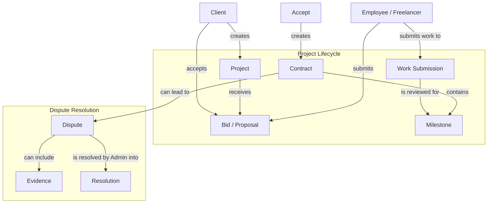
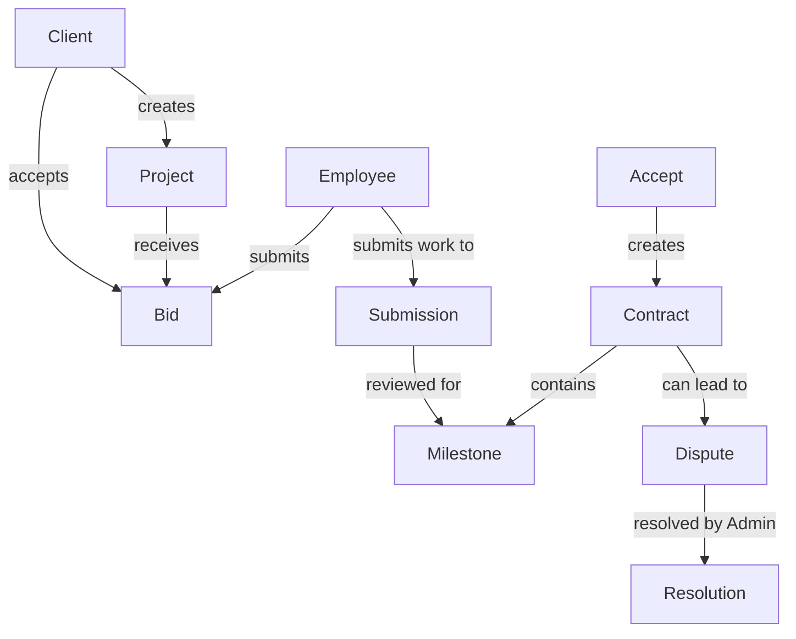

# Project & Service Management

## Overview
The project management module enables clients to post projects, freelancers to bid, and manages contracts, milestones, and disputes.

## Architecture Diagram



## Components

### Project
| Field | Description |
|-------|-------------|
| title | Project title |
| description | Project details |
| budget_type | Fixed price or hourly |
| budget_min | Minimum budget |
| budget_max | Maximum budget |
| deadline | Project deadline |
| skills | Required skills |
| status | Open, in_progress, completed, cancelled |

### Bid
| Field | Description |
|-------|-------------|
| amount | Bid amount |
| delivery_time | Estimated delivery |
| cover_letter | Proposal message |
| attachments | Portfolio items |
| status | Pending, accepted, rejected, withdrawn |

### Contract
| Field | Description |
|-------|-------------|
| project_id | Associated project |
| employee_id | Assigned freelancer |
| amount | Contract amount |
| milestones | Payment milestones |
| status | Active, completed, terminated |
| signed_at | Contract signing date |

### Milestone
| Field | Description |
|-------|-------------|
| title | Milestone name |
| description | Deliverable description |
| amount | Milestone payment |
| due_date | Completion deadline |
| status | Pending, submitted, approved, paid |

## Database Schema

```sql
-- Projects
CREATE TABLE projects (
    id UUID PRIMARY KEY DEFAULT gen_random_uuid(),
    client_id UUID REFERENCES clients(id) ON DELETE CASCADE,
    title VARCHAR(255) NOT NULL,
    slug VARCHAR(255) UNIQUE NOT NULL,
    description TEXT,
    budget_type VARCHAR(20) NOT NULL,
    budget_min DECIMAL(10,2),
    budget_max DECIMAL(10,2),
    deadline TIMESTAMP,
    skills TEXT[],
    status VARCHAR(20) DEFAULT 'open',
    views INT DEFAULT 0,
    created_at TIMESTAMP DEFAULT NOW(),
    updated_at TIMESTAMP DEFAULT NOW()
);

-- Bids
CREATE TABLE bids (
    id UUID PRIMARY KEY DEFAULT gen_random_uuid(),
    project_id UUID REFERENCES projects(id) ON DELETE CASCADE,
    employee_id UUID REFERENCES employees(id) ON DELETE CASCADE,
    amount DECIMAL(10,2) NOT NULL,
    delivery_time INT NOT NULL,
    cover_letter TEXT,
    attachments JSONB,
    status VARCHAR(20) DEFAULT 'pending',
    created_at TIMESTAMP DEFAULT NOW(),
    updated_at TIMESTAMP DEFAULT NOW()
);

-- Contracts
CREATE TABLE contracts (
    id UUID PRIMARY KEY DEFAULT gen_random_uuid(),
    project_id UUID REFERENCES projects(id) ON DELETE CASCADE,
    employee_id UUID REFERENCES employees(id),
    amount DECIMAL(10,2) NOT NULL,
    status VARCHAR(20) DEFAULT 'active',
    signed_at TIMESTAMP,
    start_date TIMESTAMP,
    end_date TIMESTAMP,
    terms TEXT,
    created_at TIMESTAMP DEFAULT NOW(),
    updated_at TIMESTAMP DEFAULT NOW()
);

-- Milestones
CREATE TABLE milestones (
    id UUID PRIMARY KEY DEFAULT gen_random_uuid(),
    contract_id UUID REFERENCES contracts(id) ON DELETE CASCADE,
    title VARCHAR(255) NOT NULL,
    description TEXT,
    amount DECIMAL(10,2) NOT NULL,
    due_date TIMESTAMP,
    status VARCHAR(20) DEFAULT 'pending',
    completed_at TIMESTAMP,
    created_at TIMESTAMP DEFAULT NOW()
);

-- Disputes
CREATE TABLE disputes (
    id UUID PRIMARY KEY DEFAULT gen_random_uuid(),
    contract_id UUID REFERENCES contracts(id) ON DELETE CASCADE,
    raised_by UUID REFERENCES users(id),
    reason VARCHAR(100) NOT NULL,
    description TEXT,
    status VARCHAR(20) DEFAULT 'open',
    resolution TEXT,
    resolved_by UUID REFERENCES users(id),
    resolved_at TIMESTAMP,
    created_at TIMESTAMP DEFAULT NOW()
);
```

## GraphQL Operations

### Queries
```graphql
type Query {
    # Project queries
    projects(filter: ProjectFilter, page: Int, limit: Int): ProjectConnection!
    projectBySlug(slug: String!): Project!
    projectById(id: ID!): Project!
    myOpenProjects(clientId: ID!): [Project!]!
    myActiveProjects(clientId: ID!): [Project!]!
    myCompletedProjects(clientId: ID!): [Project!]!
    
    # Bid queries
    projectBids(projectId: ID!): [Bid!]!
    bidDetails(projectId: ID!, bidId: ID!): Bid!
    myBids: [Bid!]!
    
    # Contract queries
    clientContracts(clientId: ID!, status: String): [Contract!]!
    contractById(id: ID!): Contract!
    
    # Dispute queries
    clientDisputes(clientId: ID!): [Dispute!]!
    disputeById(id: ID!): Dispute!
}
```

### Mutations
```graphql
type Mutation {
    # Project mutations
    createProject(input: CreateProjectInput!): ProjectResponse!
    updateProject(id: ID!, input: UpdateProjectInput!): ProjectResponse!
    updateProjectStatus(id: ID!, status: ProjectStatus!): ProjectResponse!
    deleteProject(id: ID!): DeleteResponse!
    
    # Bid mutations
    createBid(projectId: ID!, input: BidInput!): BidResponse!
    acceptBid(projectId: ID!, bidId: ID!): ContractResponse!
    rejectBid(bidId: ID!): DeleteResponse!
    withdrawBid(bidId: ID!): DeleteResponse!
    
    # Contract mutations
    submitProject(projectId: ID!, message: String!, files: [Upload!]): SubmissionResponse!
    releasePayment(milestoneId: ID!): PaymentResponse!
    requestRefund(paymentId: ID!, reason: String!): RefundResponse!
    
    # Dispute mutations
    createDispute(input: DisputeInput!): DisputeResponse!
    addDisputeEvidence(disputeId: ID!, input: DisputeEvidenceInput!): EvidenceResponse!
    addDisputeMessage(disputeId: ID!, content: String!): MessageResponse!
}
```

## Input Types

```graphql
input CreateProjectInput {
    title: String!
    description: String!
    budgetType: BudgetType!
    budgetMin: Float
    budgetMax: Float
    deadline: String!
    skills: [String!]!
    experience: String!
    location: String
    isRemote: Boolean!
    attachments: [Upload!]
}

input BidInput {
    amount: Float!
    deliveryTime: Int!
    coverLetter: String!
    attachments: [Upload!]
    milestones: [MilestoneInput!]
}

input DisputeInput {
    projectId: ID!
    contractId: ID!
    reason: String!
    description: String!
    evidence: [DisputeEvidenceInput!]
}
```

## Response Types

```graphql
type Project {
    id: ID!
    title: String!
    slug: String!
    description: String!
    budgetType: BudgetType!
    budgetMin: Float
    budgetMax: Float
    deadline: String!
    skills: [String!]!
    experience: String!
    location: String
    isRemote: Boolean!
    status: ProjectStatus!
    proposals: Int!
    views: Int!
    client: Client!
    createdAt: String!
    updatedAt: String!
}

type Contract {
    id: ID!
    projectId: ID!
    project: Project!
    employee: Employee!
    amount: Float!
    currency: String!
    startDate: String!
    endDate: String!
    status: ContractStatus!
    milestones: [Milestone!]!
    payments: [Payment!]!
    terms: String
    signedAt: String
}

type Dispute {
    id: ID!
    projectId: ID!
    contractId: ID!
    reason: String!
    description: String!
    status: DisputeStatus!
    evidence: [Evidence!]!
    messages: [Message!]!
    resolution: String
    createdAt: String!
    resolvedAt: String
}
```

## Error Codes

| Code | Description |
|------|-------------|
| PROJ_001 | Project not found |
| PROJ_002 | Project already assigned |
| PROJ_003 | Cannot modify closed project |
| BID_001 | Bid not found |
| BID_002 | Bid already exists |
| BID_003 | Cannot bid on own project |
| BID_004 | Bid below minimum |
| CONT_001 | Contract not found |
| CONT_002 | Contract already active |
| CONT_003 | Cannot modify active contract |
| MIL_001 | Milestone not found |
| MIL_002 | Milestone not completed |
| DISP_001 | Dispute not found |
| DISP_002 | Dispute already closed |
| DISP_003 | Cannot dispute resolved contract |

## Related Documentation
- [HR Management](../04-hr/04-jobs-hr.md)
- [Wallet & Payment](../03-wallet/03-wallet-payment.md)
- [Security & Compliance](../12-security/13-security-compliance.md)


