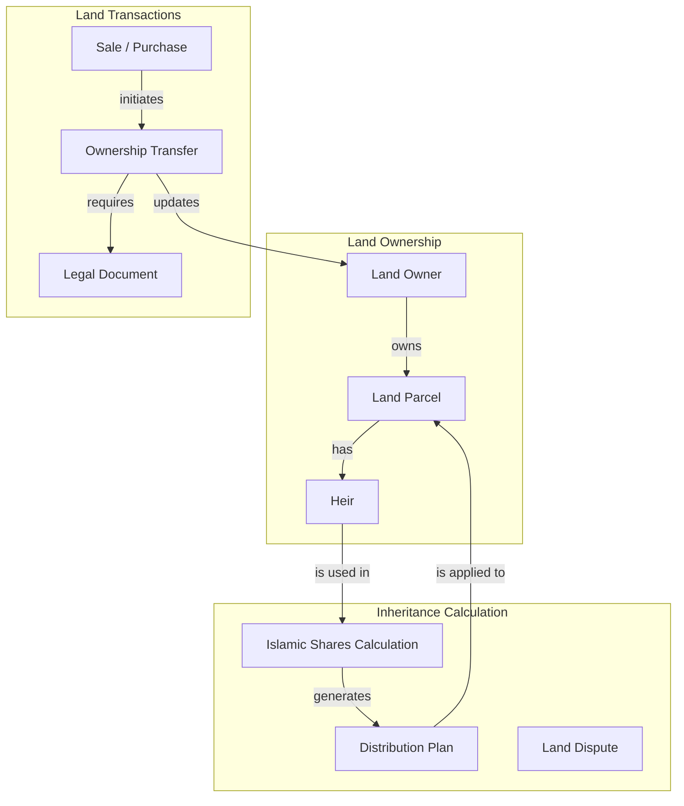

# Land & Inheritance Management

## Overview
The land management module handles land ownership records, heir management, land transactions, and Islamic inheritance calculation.

## Architecture Diagram



## Components

### Land Owner
| Field | Description |
|-------|-------------|
| name | Owner full name |
| national_id | National ID number |
| phone | Contact phone |
| email | Contact email |
| address | Physical address |
| status | Active, deceased |

### Land Parcel
| Field | Description |
|-------|-------------|
| name | Land name/title |
| location | Geographic location |
| original_area | Original land area |
| current_area | Current area after changes |
| price_per_unit | Value per unit area |
| total_value | Total land value |
| status | Available, sold, inherited, disputed |

### Heir
| Field | Description |
|-------|-------------|
| name | Heir full name |
| relation | Relationship to owner |
| share_percentage | Inheritance percentage |
| can_buy | Permission to purchase |
| can_sell | Permission to sell |
| is_alive | Living status |

### Inheritance Calculation (Islamic)
| Heir Type | Share | Conditions |
|-----------|-------|------------|
| Husband | 1/4 or 1/2 | 1/4 if children exist, 1/2 if no children |
| Wife | 1/8 or 1/4 | 1/8 if children exist, 1/4 if no children |
| Son | Residue | After fixed shares |
| Daughter | 1/2 or residue | 1/2 if single, residue if multiple |
| Father | 1/6 or residue | 1/6 if son exists, residue if no son |
| Mother | 1/6 or 1/3 | 1/6 if children exist, 1/3 if no children |

## Database Schema

```sql
-- Land Owners
CREATE TABLE land_owners (
    id UUID PRIMARY KEY DEFAULT gen_random_uuid(),
    name VARCHAR(255) NOT NULL,
    national_id VARCHAR(50) UNIQUE NOT NULL,
    phone VARCHAR(20),
    email VARCHAR(255),
    address TEXT,
    birth_date DATE,
    status VARCHAR(20) DEFAULT 'active',
    created_at TIMESTAMP DEFAULT NOW(),
    updated_at TIMESTAMP DEFAULT NOW()
);

-- Land Parcels
CREATE TABLE land_parcels (
    id UUID PRIMARY KEY DEFAULT gen_random_uuid(),
    owner_id UUID REFERENCES land_owners(id) ON DELETE CASCADE,
    name VARCHAR(255) NOT NULL,
    slug VARCHAR(255) UNIQUE NOT NULL,
    location VARCHAR(255),
    location_details JSONB,
    original_area DECIMAL(12,2) NOT NULL,
    current_area DECIMAL(12,2) NOT NULL,
    price_per_unit DECIMAL(12,2),
    total_value DECIMAL(15,2) GENERATED ALWAYS AS (current_area * price_per_unit) STORED,
    status VARCHAR(20) DEFAULT 'active',
    coordinates JSONB,
    documents JSONB,
    images TEXT[],
    tags TEXT[],
    created_at TIMESTAMP DEFAULT NOW(),
    updated_at TIMESTAMP DEFAULT NOW()
);

-- Heirs
CREATE TABLE heirs (
    id UUID PRIMARY KEY DEFAULT gen_random_uuid(),
    land_id UUID REFERENCES land_parcels(id) ON DELETE CASCADE,
    name VARCHAR(255) NOT NULL,
    relation VARCHAR(50) NOT NULL,
    share_percentage DECIMAL(5,2),
    inherited_area DECIMAL(12,2),
    can_buy BOOLEAN DEFAULT false,
    can_sell BOOLEAN DEFAULT false,
    is_alive BOOLEAN DEFAULT true,
    phone VARCHAR(20),
    email VARCHAR(255),
    national_id VARCHAR(50),
    created_at TIMESTAMP DEFAULT NOW(),
    updated_at TIMESTAMP DEFAULT NOW()
);

-- Land Transactions
CREATE TABLE land_transactions (
    id UUID PRIMARY KEY DEFAULT gen_random_uuid(),
    land_id UUID REFERENCES land_parcels(id) ON DELETE CASCADE,
    type VARCHAR(20) NOT NULL,
    from_owner_id UUID REFERENCES land_owners(id),
    to_owner_id UUID REFERENCES land_owners(id),
    area DECIMAL(12,2) NOT NULL,
    price DECIMAL(15,2),
    date DATE NOT NULL,
    description TEXT,
    status VARCHAR(20) DEFAULT 'pending',
    documents JSONB,
    contract_number VARCHAR(100),
    witness1 VARCHAR(255),
    witness2 VARCHAR(255),
    lawyer_approval BOOLEAN DEFAULT false,
    court_registration BOOLEAN DEFAULT false,
    created_at TIMESTAMP DEFAULT NOW(),
    updated_at TIMESTAMP DEFAULT NOW()
);

-- Inheritance Calculations
CREATE TABLE inheritance_calculations (
    id UUID PRIMARY KEY DEFAULT gen_random_uuid(),
    land_id UUID REFERENCES land_parcels(id) ON DELETE CASCADE,
    total_area DECIMAL(12,2) NOT NULL,
    total_value DECIMAL(15,2),
    heirs JSONB,
    shares JSONB,
    distribution JSONB,
    remaining_estate DECIMAL(15,2),
    notes TEXT,
    created_at TIMESTAMP DEFAULT NOW()
);
```

## GraphQL Operations

### Queries
```graphql
type Query {
    # Land queries
    lands(filter: LandFilter, page: Int, limit: Int): LandConnection!
    landById(id: ID!): Land!
    landBySlug(slug: String!): Land!
    landByNationalId(nationalId: String!): [Land!]!
    
    # Owner queries
    landOwners: [LandOwner!]!
    landOwnerById(id: ID!): LandOwner!
    
    # Heir queries
    heirs(landId: ID!): [Heir!]!
    heirDistribution: HeirDistribution!
    
    # Transaction queries
    transactions(filter: TransactionFilter): TransactionConnection!
    transactionById(id: ID!): Transaction!
    
    # Inheritance queries
    inheritanceCalculation(landId: ID!): InheritanceCalculation!
    islamicShares(landId: ID!): IslamicShares!
    
    # Statistics
    landStats: LandStats!
    locationStats: [LocationStat!]!
    heirAnalysis: HeirAnalysis!
}
```

### Mutations
```graphql
type Mutation {
    # Land mutations
    createLand(input: LandOwnerInput!): LandResponse!
    updateLand(id: ID!, input: LandOwnerInput!): LandResponse!
    deleteLand(id: ID!): DeleteResponse!
    updateLandStatus(id: ID!, status: LandStatus!): LandResponse!
    bulkCreateLands(lands: [LandOwnerInput!]!): [Land!]!
    bulkUpdateLands(ids: [ID!]!, updates: LandOwnerInput!): [Land!]!
    bulkDeleteLands(ids: [ID!]!): DeleteResponse!
    
    # Heir mutations
    addHeir(landId: ID!, heir: HeirInput!): LandResponse!
    updateHeir(landId: ID!, heirId: ID!, heir: HeirInput!): LandResponse!
    deleteHeir(landId: ID!, heirId: ID!): LandResponse!
    bulkUpdateHeirs(updates: [HeirBulkUpdateInput!]!): [Heir!]!
    bulkDeleteHeirs(ids: [HeirDeleteInput!]!): DeleteResponse!
    
    # Transaction mutations
    createTransaction(input: TransactionInput!): TransactionResponse!
    updateTransaction(id: ID!, input: TransactionInput!): TransactionResponse!
    deleteTransaction(id: ID!): DeleteResponse!
    updateTransactionStatus(id: ID!, status: TransactionStatus!): TransactionResponse!
    bulkUpdateTransactions(updates: [TransactionBulkUpdateInput!]!): [Transaction!]!
    bulkDeleteTransactions(ids: [ID!]!): DeleteResponse!
    
    # Inheritance mutations
    calculateInheritance(landId: ID!): InheritanceCalculationResponse!
    calculateLandValue(landId: ID!, pricePerUnit: Float): LandValueResponse!
    
    # Import/Export
    importLands(file: Upload!): ImportResponse!
    exportLands(format: String): ExportResponse!
    exportLandsWithFilters(input: ExportInput!): ExportResponse!
    generateReport(input: ReportInput!): ReportResponse!
    scheduleReport(input: ScheduleReportInput!): ScheduledReportResponse!
}
```

## Input Types

```graphql
input LandOwnerInput {
    name: String!
    location: String!
    originalArea: Float!
    currentArea: Float!
    nationalId: String!
    phone: String!
    email: String
    address: String
    birthDate: String
    notes: String
    documents: [Upload!]
    images: [Upload!]
    tags: [String!]
    priority: Int
    coordinates: CoordinatesInput
    metaTitle: String
    metaDescription: String
    keywords: [String!]
}

input HeirInput {
    name: String!
    relation: String!
    sharePercentage: Float
    canBuy: Boolean
    canSell: Boolean
    isAlive: Boolean
    phone: String
    email: String
    nationalId: String
    birthDate: String
    address: String
    notes: String
}

input TransactionInput {
    landId: ID!
    type: TransactionType!
    fromOwnerId: ID
    toOwnerId: ID!
    area: Float!
    price: Float!
    date: String!
    description: String
    documents: [Upload!]
    witness1: String
    witness2: String
    lawyerApproval: Boolean
    courtRegistration: Boolean
    contractNumber: String
    notes: String
}
```

## Response Types

```graphql
type Land {
    id: ID!
    slug: String!
    name: String!
    location: String!
    locationDetails: JSON
    originalArea: Float!
    currentArea: Float!
    addedArea: Float!
    deductions: Float!
    totalResult: Float!
    pricePerUnit: Float
    totalValue: Float
    nationalId: String!
    phone: String!
    email: String
    address: String
    birthDate: String
    heirs: [Heir!]!
    transactions: [Transaction!]!
    notes: String
    documents: [String!]
    tags: [String!]
    priority: Int
    status: LandStatus!
    type: LandType!
    coordinates: Coordinates
    images: [String!]
    videos: [String!]
    attachments: [String!]
    metaTitle: String
    metaDescription: String
    keywords: [String!]
    registrationDate: String
    lastTransactionDate: String
    createdAt: String!
    updatedAt: String!
    createdBy: User
    updatedBy: User
}

type InheritanceCalculation {
    land: Land!
    heirs: [HeirShare!]!
    islamicShares: [IslamicShare!]!
    calculatedShares: [CalculatedShare!]!
    remainingEstate: Float!
    notes: String
}

type IslamicShare {
    relation: String!
    share: String!
    description: String!
}

type LandStats {
    totalLands: Int!
    totalOwners: Int!
    totalArea: Float!
    totalValue: Float!
    activeLands: Int!
    pendingTransactions: Int!
    monthlyGrowth: Float!
    topLocations: [LocationStat!]!
    recentTransactions: [Transaction!]!
}
```

## Islamic Inheritance Rules

### Fixed Sharers (Ashab al-Furud)

| Heir | Share | Condition |
|------|-------|-----------|
| Husband | 1/2 | No children |
| Husband | 1/4 | Has children |
| Wife | 1/4 | No children |
| Wife | 1/8 | Has children |
| Daughter | 1/2 | One daughter only |
| Daughter | 2/3 | Two or more daughters |
| Son's Daughter | 1/2 | One, no son or daughter |
| Son's Daughter | 2/3 | Two or more, no son or daughter |
| Father | 1/6 | Has son |
| Father | Residue | No son |
| Mother | 1/6 | Has children |
| Mother | 1/3 | No children |
| Full Brother | 1/6 | Has one daughter |
| Full Sister | 1/2 | One sister, no children |
| Full Sister | 2/3 | Two or more sisters |

## Error Codes

| Code | Description |
|------|-------------|
| LAND_001 | Land not found |
| LAND_002 | National ID already exists |
| LAND_003 | Invalid area value |
| HEIR_001 | Heir not found |
| HEIR_002 | Invalid share percentage |
| HEIR_003 | Share total exceeds 100% |
| TRANS_001 | Transaction not found |
| TRANS_002 | Invalid transaction type |
| TRANS_003 | Insufficient area |
| INH_001 | Invalid inheritance calculation |
| INH_002 | No heirs found |
| INH_003 | Invalid Islamic share |

## Related Documentation
- [Admin Governance](../07-admin/07-admin-governance.md)
- [Security & Compliance](../12-security/13-security-compliance.md)
