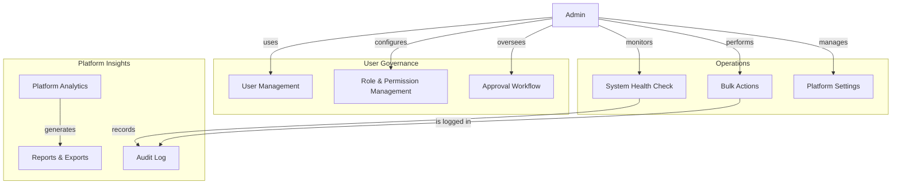
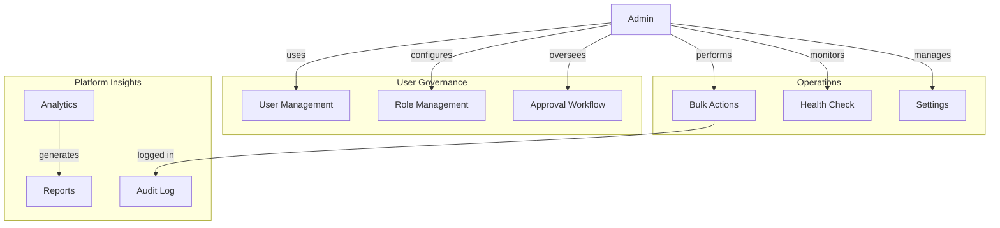

# Admin & Governance

## Overview
The admin module provides comprehensive management capabilities for platform administrators including user management, role configuration, analytics, and operational tools.

## Architecture Diagram



## Components

### User Management
| Feature | Description |
|---------|-------------|
| User List | View all platform users with filters |
| User Details | View user profile, activity, transactions |
| User Actions | Activate, suspend, delete users |
| User Search | Search by name, email, ID, role |
| User Export | Export user data to CSV/Excel |

### Role & Permission Management
| Feature | Description |
|---------|-------------|
| Role List | View all available roles |
| Role Creation | Create new custom roles |
| Permission Assignment | Assign permissions to roles |
| Role Assignment | Assign roles to users |
| Permission Categories | Group permissions by module |

### Approval Workflows
| Workflow | Description |
|----------|-------------|
| Seller Approval | Review and approve new sellers |
| Developer Approval | Review developer applications |
| Withdrawal Approval | Review large withdrawal requests |
| Theme Approval | Review submitted themes |
| Integration Approval | Review marketplace apps |

### Platform Analytics
| Metric | Description |
|--------|-------------|
| User Growth | New users over time |
| Revenue | Platform revenue trends |
| Transactions | Transaction volume and value |
| Active Stores | Number of active stores |
| App Installs | Marketplace app installs |
| Withdrawal Volume | Total withdrawals processed |

## Database Schema

```sql
-- Admin Actions Log
CREATE TABLE admin_actions (
    id UUID PRIMARY KEY DEFAULT gen_random_uuid(),
    admin_id UUID REFERENCES users(id),
    action VARCHAR(100) NOT NULL,
    entity_type VARCHAR(50),
    entity_id UUID,
    old_values JSONB,
    new_values JSONB,
    ip_address INET,
    user_agent TEXT,
    created_at TIMESTAMP DEFAULT NOW()
);

-- Approval Requests
CREATE TABLE approval_requests (
    id UUID PRIMARY KEY DEFAULT gen_random_uuid(),
    entity_type VARCHAR(50) NOT NULL,
    entity_id UUID NOT NULL,
    requested_by UUID REFERENCES users(id),
    status VARCHAR(20) DEFAULT 'pending',
    notes TEXT,
    reviewed_by UUID REFERENCES users(id),
    reviewed_at TIMESTAMP,
    created_at TIMESTAMP DEFAULT NOW()
);

-- System Settings
CREATE TABLE system_settings (
    id UUID PRIMARY KEY DEFAULT gen_random_uuid(),
    key VARCHAR(100) UNIQUE NOT NULL,
    value JSONB NOT NULL,
    description TEXT,
    updated_by UUID REFERENCES users(id),
    updated_at TIMESTAMP DEFAULT NOW()
);

-- Reports
CREATE TABLE reports (
    id UUID PRIMARY KEY DEFAULT gen_random_uuid(),
    title VARCHAR(255) NOT NULL,
    type VARCHAR(50) NOT NULL,
    parameters JSONB,
    file_url VARCHAR(500),
    file_size INT,
    status VARCHAR(20) DEFAULT 'pending',
    generated_by UUID REFERENCES users(id),
    generated_at TIMESTAMP,
    expires_at TIMESTAMP,
    download_count INT DEFAULT 0,
    created_at TIMESTAMP DEFAULT NOW()
);

-- System Health Checks
CREATE TABLE health_checks (
    id UUID PRIMARY KEY DEFAULT gen_random_uuid(),
    service VARCHAR(50) NOT NULL,
    status VARCHAR(20),
    response_time INT,
    error_message TEXT,
    checked_at TIMESTAMP DEFAULT NOW()
);
```

## GraphQL Operations

### Queries
```graphql
type Query {
    # User management
    adminUsers(page: Int, limit: Int, search: String, roleFilter: String): AdminUserConnection!
    adminUser(id: ID!): User!
    userPointsHistory(userId: ID!): [PointsHistory!]!
    availableRoles: [String!]!
    
    # Role management
    allPermissions: [Permission!]!
    rolePermissions(role: String!): RolePermissions!
    allRolesPermissions: [RolePermissions!]!
    permissionCategories: [String!]!
    
    # Order management
    adminOrders(page: Int, limit: Int, search: String, status: String): AdminOrderConnection!
    adminOrder(id: ID!): Order!
    adminOrderStats(dateFrom: String, dateTo: String): OrderStats!
    adminOrderChartData(period: String!, dateFrom: String, dateTo: String): ChartData!
    
    # Reports
    recentReports(limit: Int): [Report!]!
    activeAlerts: [Alert!]!
    reportStats: ReportStats!
    earningsReport(period: String): EarningsReport!
    commissionReport(period: String): CommissionReport!
    
    # Withdrawal management
    adminWithdrawals(filter: WithdrawalFilterInput): AdminWithdrawalConnection!
    adminWithdrawalStats: WithdrawalStats!
    adminPayouts(filter: PayoutFilterInput): AdminPayoutConnection!
    adminPayoutAnalytics(filter: PayoutAnalyticsFilter!): PayoutAnalytics!
    adminPayoutSummary: PayoutSummary!
    
    # System
    systemInfo: SystemInfo!
    adminIntegrations(status: String, type: String, search: String): AdminIntegrationConnection!
    pendingApprovals(type: String, page: Int, limit: Int): ApprovalConnection!
    integrationAnalytics(period: String): IntegrationAnalytics!
}
```

### Mutations
```graphql
type Mutation {
    # User management
    updateUserRoles(userId: ID!, roles: [String!]!): UserResponse!
    addUserRole(userId: ID!, role: String!): UserResponse!
    removeUserRole(userId: ID!, role: String!): UserResponse!
    updateUserDetails(userId: ID!, input: UpdateUserInput!): UserResponse!
    toggleUserStatus(userId: ID!, isActive: Boolean!): UserResponse!
    adjustUserPoints(userId: ID!, amount: Int!, description: String!, type: AdjustPointsType!): PointsResponse!
    deleteUser(userId: ID!): DeleteResponse!
    
    # Role management
    updateRolePermissions(role: String!, permissions: [String!]!): RoleResponse!
    resetRolePermissions(role: String!): RoleResponse!
    cloneRolePermissions(fromRole: String!, toRole: String!): RoleResponse!
    
    # Order management
    adminUpdateOrderStatus(id: ID!, status: String!): OrderResponse!
    deleteOrder(id: ID!): DeleteResponse!
    markAsPaid(id: ID!): OrderResponse!
    markAsDelivered(id: ID!): OrderResponse!
    updateTrackingInfo(id: ID!, trackingInfo: TrackingInfoInput!): OrderResponse!
    bulkUpdateOrders(ids: [ID!]!, status: String!): BulkUpdateResponse!
    addOrderNote(id: ID!, note: String!): OrderResponse!
    
    # Payout management
    processPayout(payoutId: ID!, transactionId: String!): PayoutResponse!
    approveWithdrawal(withdrawalId: ID!): WithdrawalResponse!
    rejectWithdrawal(withdrawalId: ID!, reason: String!): WithdrawalResponse!
    bulkUpdatePayouts(payoutIds: [ID!]!, status: PayoutStatus!): BulkUpdateResponse!
    reviewPayoutRisk(input: RiskReviewInput!): RiskReviewResponse!
    updatePayoutStatus(payoutId: ID!, status: PayoutStatus!): PayoutResponse!
    addAdminNote(payoutId: ID!, note: AdminNoteInput!): AdminNoteResponse!
    
    # Settings
    updateSettings(input: SettingsInput!): SettingsResponse!
    updateDeveloperCommissionSettings(input: UpdateDeveloperSettingsInput!): DeveloperSettingsResponse!
    updatePlatformCommission(input: PlatformCommissionInput!): CommissionResponse!
    updateDeveloperSettings(input: UpdateDeveloperSettingsInput!): DeveloperSettingsResponse!
    updatePlatformWarehouseSettings(input: PlatformWarehouseSettingsInput!): WarehouseSettingsResponse!
    
    # Reports
    generateReport(input: ReportInput!): ReportResponse!
    deleteReport(id: ID!): DeleteResponse!
    exportReport(id: ID!, format: String!): ExportResponse!
    shareReport(id: ID!, emails: [String!]!, permission: String!): ShareResponse!
    saveReport(input: SaveReportInput!): ReportResponse!
    updateSavedReport(id: ID!, input: UpdateReportInput!): ReportResponse!
    deleteSavedReport(id: ID!): DeleteResponse!
    
    # Bulk operations
    bulkCreditDevelopers(developerIds: [String!]!, amount: Float!, description: String!): BulkCreditResponse!
    bulkProcessWithdrawals(input: BulkProcessWithdrawalsInput!): BulkProcessResponse!
    bulkApproveThemes(themeIds: [ID!]!): BulkApproveResponse!
    bulkRejectThemes(themeIds: [ID!]!, reason: String!): BulkRejectResponse!
    bulkDeleteWarehouses(input: BulkDeleteWarehousesInput!): BulkDeleteResponse!
    bulkIntegrationOperations(operations: [BulkIntegrationOperation!]!): BulkOperationResponse!
}
```

## Input Types

```graphql
input UpdateUserInput {
    name: String
    email: String
    phone: String
    department: String
    position: String
    isActive: Boolean
}

input SettingsInput {
    site: SiteSettingsInput
    common: CommonSettingsInput
    points: PointsSettingsInput
    marketplace: MarketplaceSettingsInput
    subscriptions: SubscriptionSettingsInput
    languages: [LanguageInput!]
    currencies: [CurrencyInput!]
    paymentMethods: [PaymentMethodInput!]
}

input ReportInput {
    type: ReportType!
    parameters: ReportParametersInput!
    format: ReportFormat!
    schedule: ScheduleInput
    recipients: [String!]
}
```

## Response Types

```graphql
type AdminUserConnection {
    users: [User!]!
    totalPages: Int!
    currentPage: Int!
    totalCount: Int!
}

type RolePermissions {
    role: String!
    roleName: String!
    permissions: [PermissionDetail!]!
}

type Permission {
    name: String!
    description: String!
    category: String!
}

type PermissionDetail {
    name: String!
    description: String!
    category: String!
    enabled: Boolean!
}

type AdminOrderConnection {
    orders: [Order!]!
    totalPages: Int!
    currentPage: Int!
    totalCount: Int!
}

type OrderStats {
    totalOrders: Int!
    totalRevenue: Float!
    averageOrderValue: Float!
    pendingOrders: Int!
    processingOrders: Int!
    shippedOrders: Int!
    deliveredOrders: Int!
    cancelledOrders: Int!
    paidOrders: Int!
    unpaidOrders: Int!
    todayOrders: Int!
    todayRevenue: Float!
    thisWeekOrders: Int!
    thisWeekRevenue: Float!
    thisMonthOrders: Int!
    thisMonthRevenue: Float!
}

type ReportStats {
    totalEarnings: Float!
    earningsGrowth: Float!
    totalUsers: Int!
    newUsersThisMonth: Int!
    totalCommission: Float!
    commissionRate: Float!
    pendingWithdrawals: Float!
    pendingCount: Int!
}

type SystemInfo {
    version: String!
    lastBackup: String!
    totalStorage: Float!
    usedStorage: Float!
    databaseSize: Float!
    uptime: Float!
    activeUsers: Int!
    systemLoad: Float!
}
```

## Permission Categories

| Category | Permissions |
|----------|-------------|
| Users | view_users, create_user, edit_user, delete_user, suspend_user |
| Roles | view_roles, create_role, edit_role, delete_role, assign_role |
| Orders | view_orders, edit_order, cancel_order, refund_order |
| Payments | view_payments, process_payment, refund_payment |
| Withdrawals | view_withdrawals, approve_withdrawal, reject_withdrawal |
| Products | view_products, edit_product, delete_product, publish_product |
| Stores | view_stores, edit_store, suspend_store, approve_store |
| Themes | view_themes, approve_theme, reject_theme, delete_theme |
| Reports | view_reports, generate_report, export_report |
| Settings | view_settings, edit_settings |
| System | view_logs, view_health, clear_cache, run_maintenance |

## Error Codes

| Code | Description |
|------|-------------|
| ADMIN_001 | Insufficient permissions |
| ADMIN_002 | User not found |
| ADMIN_003 | Invalid role |
| ADMIN_004 | Role already exists |
| ADMIN_005 | Cannot delete default role |
| ADMIN_006 | Invalid permission |
| ADMIN_007 | Report not found |
| ADMIN_008 | Report generation failed |
| ADMIN_009 | Invalid settings value |
| ADMIN_010 | Bulk operation failed |
| ADMIN_011 | Approval request not found |
| ADMIN_012 | Cannot approve own request |

## Related Documentation
- [User Types](../00-overview/03-user-types.md)
- [System Core](../01-core/01-system-core.md)
- [Security & Compliance](../12-security/13-security-compliance.md)


