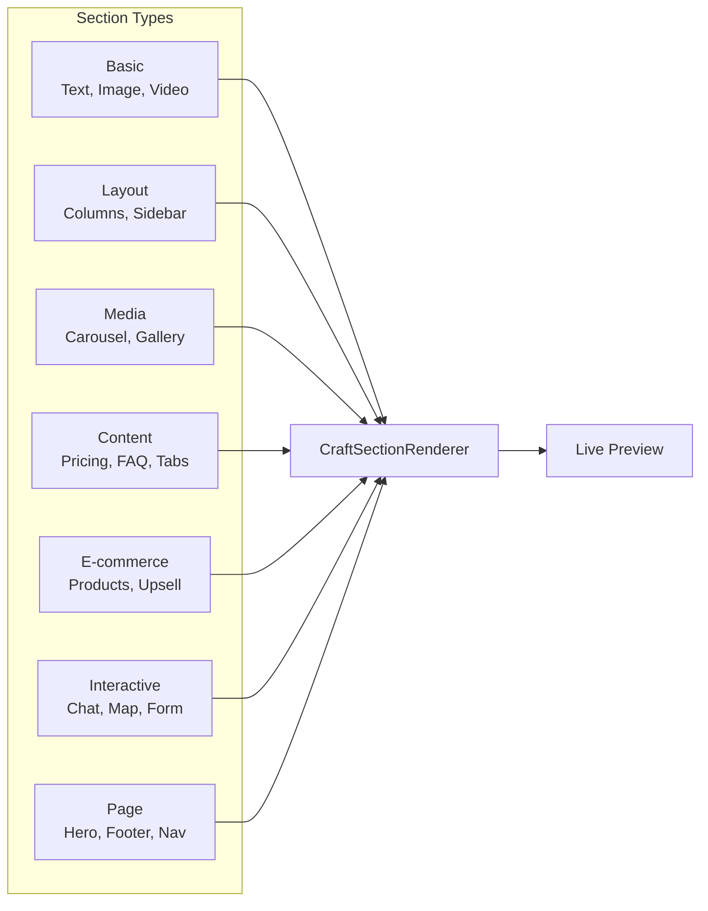

# 🏗️ Template Editor Architecture

## System Overview

The Template Editor follows a **modular component-based architecture** with clear separation between UI, state management, and API layers.

## Component Breakdown

### 1. Core Components

| Component | File | Responsibility |
|-----------|------|----------------|
| **TemplateEditor** | `TemplateEditor.tsx` | Main container with tabs and state |
| **TemplateImporter** | `TemplateImporter.tsx` | Import from JSON/ZIP/HTML |
| **TemplateLibrary** | `TemplateLibrary.tsx` | Browse and select templates |
| **CraftSectionRenderer** | `CraftSectionRenderer.tsx` | Render individual sections |

### 2. UI Sub-components

| Component | Purpose |
|-----------|---------|
| **Tabs Navigation** | 6 main tabs (General, Sections, Appearance, Content, Developer, Preview) |
| **SortableItem** | Drag & drop wrapper for sections |
| **QuickStats** | Display section count, component count, status |
| **ColorPicker** | Custom color selection with live preview |
| **CodeEditor** | Monaco editor for HTML/CSS/JS |
| **LivePreview** | Craft.js frame for real-time preview |

### 3. Custom Hooks

| Hook | Purpose |
|------|---------|
| `useTemplateBuilder` | Template CRUD operations |
| `useDesignManagement` | Design state management |
| `useTemplateExport` | Export templates as JSON/ZIP |

### 4. Section Types Architecture

## Data Flow

### Save Template Flow

1. User clicks **Save**
2. Collects all sections data
3. Sanitizes HTML/CSS/JS
4. Calls `saveTemplate` mutation
5. Stores in `Templates` collection
6. Updates local state

### Import Template Flow

1. User uploads file (JSON/ZIP/HTML)
2. Parses file content
3. Validates against schema
4. Sanitizes content
5. Creates template record
6. Updates UI with imported data

## Security Considerations

### Content Sanitization

| Type | Sanitization Method |
|------|---------------------|
| HTML | `sanitize-html` with allowed tags/attributes |
| CSS | Basic validation, remove dangerous properties |
| JS | Remove `eval()`, `Function()`, dangerous methods |

### File Validation

| File Type | Validation |
|-----------|------------|
| JSON | Schema validation (Zod) |
| ZIP | Check for malicious files |
| HTML | Size limits, tag whitelist |

---

*Next: [Data Flow Diagram](./04-template-editor-data-flow.md)*
