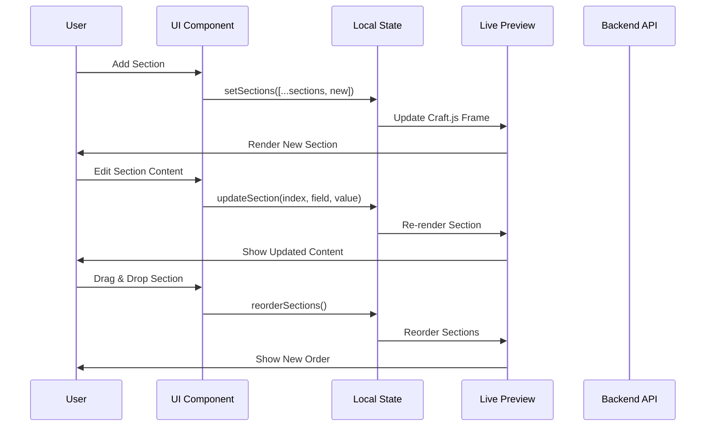
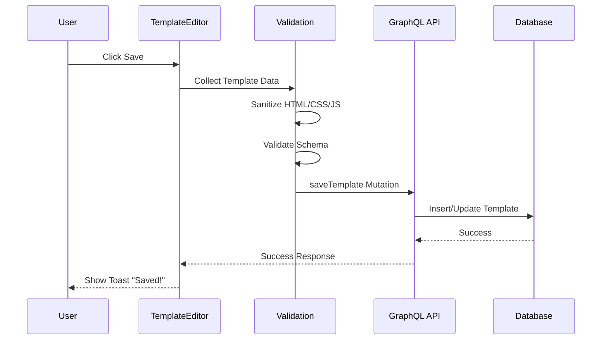
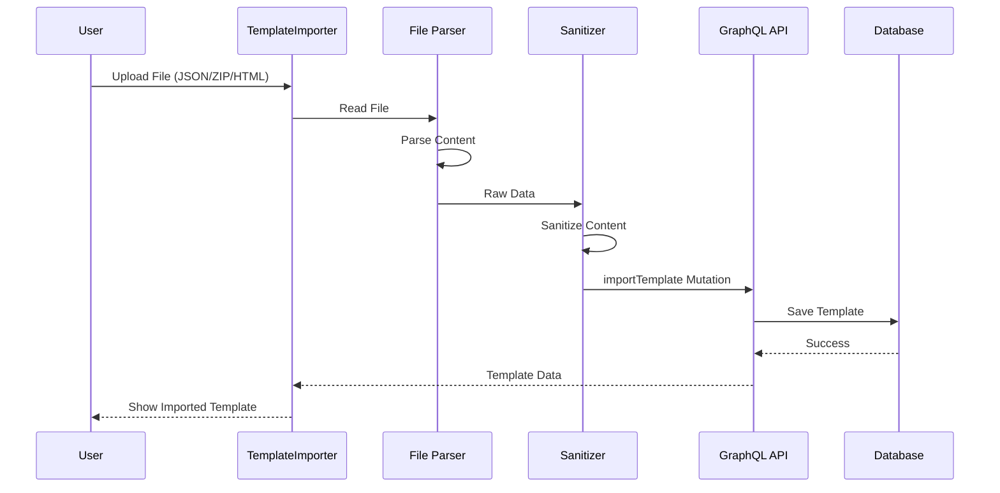

# 📊 Template Editor Data Flow

## Complete Data Flow Diagram

### 1. Section Management Flow

### 2. Save Template Flow

### 3. Import Template Flow

## State Management

### Local State Structure

| State | Type | Initial | Description |
|-------|------|---------|-------------|
| `sections` | `Section[]` | `[]` | Array of page sections |
| `templateName` | `string` | `''` | Template name |
| `theme` | `'light'\|'dark'\|'custom'` | `'light'` | Theme mode |
| `font` | `string` | `'Inter'` | Selected font |
| `colors` | `{primary,secondary,background}` | Default | Color palette |
| `components` | `string[]` | `[]` | Custom components |
| `testimonials` | `Testimonial[]` | `[]` | Testimonials data |
| `isDeveloperMode` | `boolean` | `false` | Developer mode toggle |
| `customCode` | `Record<string, string>` | `{}` | Custom HTML/CSS/JS |
| `isResponsivePreview` | `boolean` | `false` | Mobile preview mode |

### Custom Hooks

| Hook | Returns | Purpose |
|------|---------|---------|
| `useTemplateBuilder` | `{ save, loading, template }` | Template CRUD |
| `useDesignManagement` | `{ designs, themes, templates, pages }` | Design state |
| `useTemplateExport` | `{ exportTemplateAs }` | Export functionality |

## Data Validation

### Section Validation

| Field | Validation Rule |
|-------|-----------------|
| `title` | Required, min 1 char |
| `slug` | Required, URL-friendly |
| `content` | Depends on section type |
| `customHTML` | Sanitized, allowed tags only |
| `customCSS` | Valid CSS syntax |
| `customJS` | Safe JavaScript only |

### File Validation

| File Type | Max Size | Allowed Extensions |
|-----------|----------|-------------------|
| JSON | 10MB | `.json` |
| ZIP | 50MB | `.zip` |
| HTML | 5MB | `.html`, `.htm` |
| Images | 5MB | `.jpg`, `.png`, `.gif`, `.webp` |

---

*Next: [Components Overview](./06-template-editor-components.md)*
