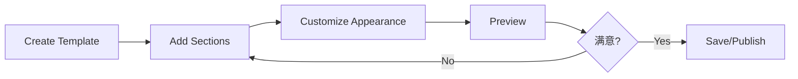

# 📖 Template Editor Usage Guide

## Getting Started

### Accessing the Template Editor

1. Log in to your **Seller Dashboard**
2. Navigate to **Design → Templates**
3. Click **Create New Template** or **Edit Existing**

### Basic Workflow

## Tab-by-Tab Guide

### 1. General Tab

**Purpose**: Basic template information and global settings

| Field | Action | Tips |
|-------|--------|------|
| Template Name | Enter name | Use descriptive names |
| Theme | Select Light/Dark/Custom | Preview affects all sections |
| Font | Choose font family | Test on mobile devices |
| Colors | Pick color palette | Use brand colors |
| Public/Private | Toggle switch | Private for testing |

### 2. Sections Tab

**Purpose**: Add, arrange, and edit page sections

#### Adding a Section

1. Click **Add Section** dropdown
2. Select section type from 30+ options
3. Section appears at bottom of list
4. Drag to reorder using handle

#### Editing Section Content

| Section Type | Editable Fields |
|--------------|-----------------|
| Text | Rich text content |
| Image | Image URL, alt text |
| Video | Video URL, poster image |
| Button | Label, URL, style |
| Heading | Text, level (h1-h6) |
| Columns | Number of columns, gap |
| Products | Product IDs, layout |

#### Section Settings

| Setting | Description |
|---------|-------------|
| Title | Section display name |
| Slug | URL-friendly identifier |
| Custom HTML | Advanced HTML override |
| Custom CSS | Section-specific styles |
| Custom JS | Section-specific scripts |

### 3. Appearance Tab

**Purpose**: Hero section, components, and testimonials

#### Hero Configuration

| Field | Description |
|-------|-------------|
| Hero Title | Main headline |
| Hero Subtitle | Supporting text |
| Background Image | Upload or URL |

#### Components Management

- Add custom components by name
- Components appear in section lists
- Use for reusable elements

#### Testimonials Management

| Field | Description |
|-------|-------------|
| Name | Customer name |
| Rating | 1-5 stars |
| Quote | Testimonial text |
| Image URL | Customer photo |

### 4. Content Tab

**Purpose**: Overview of template content

| Stat | What it shows |
|------|---------------|
| Total Sections | Number of sections |
| Active Components | Custom components count |
| Testimonials Count | Number of testimonials |
| Template Status | Public/Private |

### 5. Developer Tab

**Purpose**: Advanced code customization

#### Developer Mode

⚠️ **Warning**: Only for experienced users

| Editor | Purpose |
|--------|---------|
| HTML | Global HTML structure |
| CSS | Global styles |
| JavaScript | Global interactions |

#### Section-Level Code

Each section has individual code editors for:
- Custom HTML
- Custom CSS
- Custom JavaScript

### 6. Preview Tab

**Purpose**: Test template before publishing

#### Preview Modes

| Mode | Icon | Use Case |
|------|------|----------|
| Desktop | Monitor | Test desktop layout |
| Mobile | Smartphone | Test responsive design |

#### Live Preview Features

- Real-time updates
- Interactive elements
- Copy JSON data
- View full site

## Best Practices

### 1. Section Organization

| Tip | Description |
|-----|-------------|
| Logical Order | Header → Content → Footer |
| Group Related | Keep similar sections together |
| Limit Sections | 10-15 sections for performance |

### 2. Performance Optimization

| Practice | Benefit |
|----------|---------|
| Optimize images | Faster loading |
| Minify CSS/JS | Better performance |
| Lazy load sections | Improve initial load |

### 3. Responsive Design

| Breakpoint | Width | Testing |
|------------|-------|---------|
| Mobile | < 768px | Use mobile preview |
| Tablet | 768-1024px | Check spacing |
| Desktop | > 1024px | Full layout |

### 4. Template Management

| Action | Best Practice |
|--------|---------------|
| Naming | Use descriptive names with dates |
| Versioning | Save major versions separately |
| Backup | Export JSON as backup |

---

*Next: [Advanced Features](./09-template-editor-advanced-features.md)*
