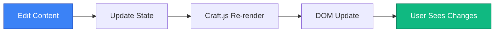
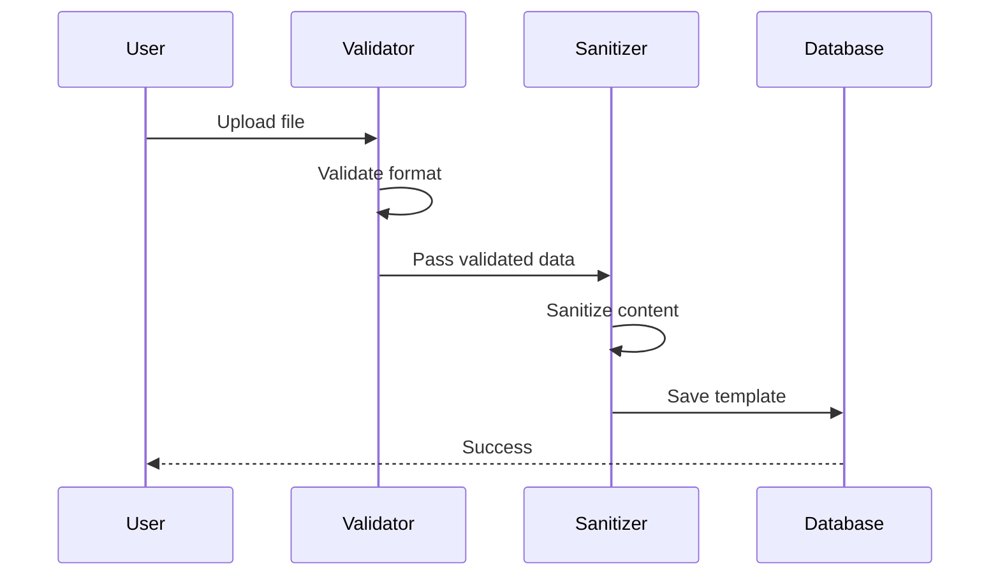

# 🚀 Template Editor Advanced Features

## 1. Advanced Section Management

### Drag & Drop System

Powered by `@dnd-kit` for smooth, accessible drag-and-drop:

| Feature | Description |
|---------|-------------|
| Vertical Sorting | Reorder sections vertically |
| Drag Handle | Grip icon indicates draggable |
| Keyboard Support | Arrow keys for reordering |
| Touch Support | Works on mobile devices |
| Animation | Smooth transitions |

### Section Types Deep Dive

#### Basic Sections

| Type | Configuration | Use Case |
|------|---------------|----------|
| Text | Rich text editor | Long form content |
| Image | URL, alt, caption | Visual elements |
| Video | YouTube/Vimeo URL | Multimedia content |
| Button | Label, URL, style | Calls to action |
| Heading | Level 1-6, text | Section titles |

#### E-commerce Sections

| Type | Features | Integration |
|------|----------|-------------|
| Products | Grid/list, filters, pagination | Product API |
| Product Card | Image, title, price, button | Single product |
| Collection Banner | Image, title, link | Category promotion |
| Upsell | Product recommendations | Cart suggestions |

#### Interactive Sections

| Type | Capabilities |
|------|--------------|
| Chat | AI-powered customer support |
| Map | Interactive location map |
| Contact Form | Custom fields, validation |
| Newsletter | Email collection, integration |

## 2. Live Preview System

### Real-time Updates



### Preview Features

| Feature | Description |
|---------|-------------|
| **Instant Updates** | Changes appear immediately |
| **Interactive Elements** | Buttons, links work |
| **Responsive Testing** | Mobile/Desktop toggle |
| **Full Site Preview** | Opens in new tab |
| **JSON Export** | Copy template data |

## 3. Code Editor (Monaco)

### Features

| Feature | Description |
|---------|-------------|
| Syntax Highlighting | HTML, CSS, JavaScript |
| Auto-completion | Code suggestions |
| Error Detection | Real-time syntax checking |
| Line Numbers | Easy navigation |
| Find/Replace | Search and replace |
| Multi-cursor | Edit multiple lines |

### Safe Code Execution

| Protection | Implementation |
|------------|----------------|
| HTML Sanitization | `sanitize-html` library |
| CSS Validation | Remove dangerous properties |
| JS Sandbox | No `eval()` or `Function()` |
| XSS Prevention | Escape user input |

## 4. Import/Export System

### Supported Formats

| Format | Content | Use Case |
|--------|---------|----------|
| JSON | Full template data | Backup, sharing |
| ZIP | Template + assets | Complete export |
| HTML | Single page | Quick import |
| Code | HTML/CSS/JS | From scratch |

### Import Process



### Export Options

| Option | Description |
|--------|-------------|
| Include Assets | Bundle images, fonts |
| Include Metadata | Version, author, date |
| Minify | Compress output |
| Format | JSON or ZIP |

## 5. Quick Stats Dashboard

### Real-time Statistics

| Stat | Calculation |
|------|-------------|
| Sections | `sections.length` |
| Components | `components.length` |
| Testimonials | `testimonials.length` |
| Status | `isPublic ? "Public" : "Private"` |

### Progress Indicator

```typescript
const progress = Math.round((sections.length / 10) * 100);
// Shows visual progress bar
```

## 6. Color & Font Customization

### Color Picker Features

| Feature | Description |
|---------|-------------|
| Hex Input | Manual color entry |
| Color Preview | Live swatch |
| Preset Colors | Common brand colors |
| Opacity | Transparency support |

### Font Options

| Category | Fonts |
|----------|-------|
| Sans-serif | Inter, Roboto, Open Sans |
| Serif | Merriweather, Playfair Display |
| Monospace | Fira Code, JetBrains Mono |
| Custom | Any Google Font |

## 7. Developer Mode

### When to Use

| Scenario | Why |
|----------|-----|
| Custom Layout | Beyond standard sections |
| Complex Animations | Advanced CSS/JS |
| Third-party Integrations | External widgets |
| Performance Tuning | Custom optimization |

### Code Injection Safety

| Type | Safety Measure |
|------|----------------|
| HTML | Whitelist allowed tags |
| CSS | Remove `expression()`, `behavior:` |
| JavaScript | Remove `eval()`, `document.write()` |

## 8. Responsive Preview

### Breakpoints

| Device | Width | Icon |
|--------|-------|------|
| Mobile | 375px | Smartphone |
| Tablet | 768px | Tablet |
| Desktop | 1280px | Monitor |
| Large Desktop | 1920px | Wide monitor |

### Testing Tips

| Test | What to Check |
|------|---------------|
| Touch Targets | Buttons easy to tap |
| Font Size | Readable on small screens |
| Images | Scale properly |
| Layout | No horizontal scroll |

---

*Next: [Troubleshooting](./10-template-editor-troubleshooting.md)*
